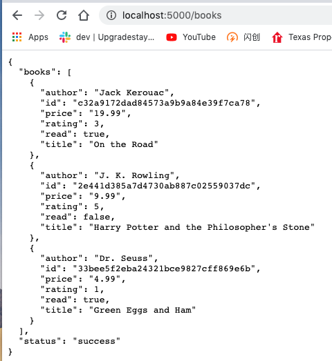

# REACT JS Learning Notes

## Start Python Server
```
cd server
source stripe/bin/activate
python app.py
```
[enter 'http://localhost:5000/books](http://localhost:5000/books)


## References
* [Online Documents](https://create-react-app.dev/docs/getting-started)
* [Home Page](https://reactjs.org/)
* [Getting started](https://reactjs.org/docs/getting-started.html)
* [Call a Flask API in React](https://www.youtube.com/watch?v=06pWsB_hoD4&t=303s)
* [JSON: JavaScript Object Notation](https://www.youtube.com/watch?v=iiADhChRriM)

## Start from scratch
```
sudo npx create-react-app wang-app
sudo chown -R wangqianjiang wang-app
cd wang-app
npm start
```
You need change ownership for all all files under the wang-app folder because you need make change on those source code. where 'wangqianjiang' is owner of my laptop.

## Install pip
```sh
phthon3 get-pip.py
```

## Install UI
```
npm i semantic-ui-react 
npm install semantic-ui-css 
```
add the followin line in index.js
```js
import 'semantic-ui-css/semantic.min.css'
```

add oneline in package.json
```json
  "eslintConfig": {
    "extends": "react-app"
  },
  "proxy":"http://localhost:5000",
  "browserslist": {
    "production": [
      ">0.2%",
      "not dead",
      "not op_mini all"
    ],
```

install react bootstrap
```bash
npm install react-bootstrap bootstrap
```