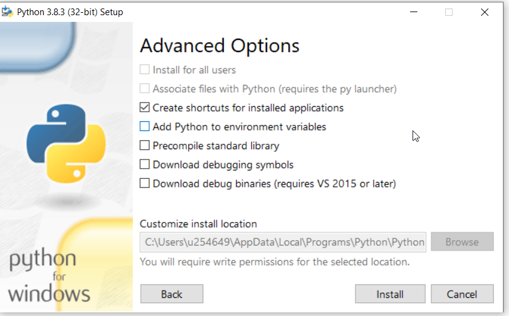

# Install python in Windows
[Python Web site](https://docs.python.org/3/using/windows.html)
[Path](C:\Users\u254649\AppData\Local\Programs\Python\Python38-32)


## Add the path to Environment Variables 
### restart VS Code


### For Windows
```sh
C:\_prectise\reactjs\wang-app\server>python -m venv envflask
C:\_prectise\reactjs\wang-app\server\envflask\Scripts>.\activate.bat
(envflask) C:\_prectise\reactjs\wang-app\server>pip install flask
(envflask) C:\_prectise\reactjs\wang-app\server>python app.py
(envflask) C:\_prectise\reactjs\wang-app\server>pip install pymongo
```
